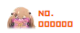

# 2stabApe-emoji-for-waline  [](https://www.jsdelivr.com/package/gh/Small-tailqwq/WaLine-emoji)
适配 WaLine 的 *第三方* 二次元表情包，来源为 [Bilibili](https://www.bilibili.com)或者 [AcFun](https://acfun.cn) ~~以后加点Ac娘表情包~~  

自己挑了一些喜欢的自己用  
注意！***无授权，非商用***

## 使用方法  

在客户端的 `WaLine` 配置下添加 `emoji` 的值为即可
```
https://cdn.jsdelivr.net/gh/Small-tailqwq/WaLine-emoji@1.1/%E5%B0%91%E5%89%8D%E5%B0%8F%E5%89%A7%E5%9C%BA/  
https://cdn.jsdelivr.net/gh/Small-tailqwq/WaLine-emoji@1.1/%E8%9B%86%E9%9F%B3%E5%A8%98/
```
  

具体配置可以参考 [WaLine官方文档](https://waline.js.org/guide/client/emoji.html#%E8%87%AA%E5%AE%9A%E4%B9%89%E8%A1%A8%E6%83%85)


> emoji 图标很小啊，效果很差怎么办啊？  

我的建议是，在 html 代码处添加如下 css 代码，其中 `3.5em` 可以自行调整

```html
<style>
.v[data-class=v] .vcontent .vemoji {
    width: 3.5em !important;
}
</style>
```
> 表情候选框里的表情也好小啊，都看不清

我的建议是，同样更改 css 样式。其中参数可以自行在F12内调整尝试再进行修改，最好确保移动端不会太大，PC端不会太小。
```html
<style>
    .v[data-class=v] .vemoji-popup .vemoji {
    max-width: 2em !important;
    max-height: 3.5em !important;
}
</style>
```